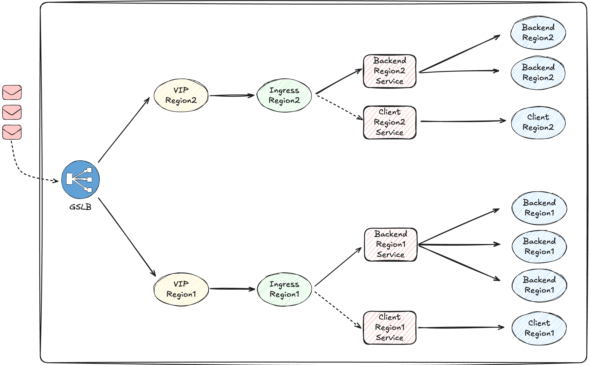
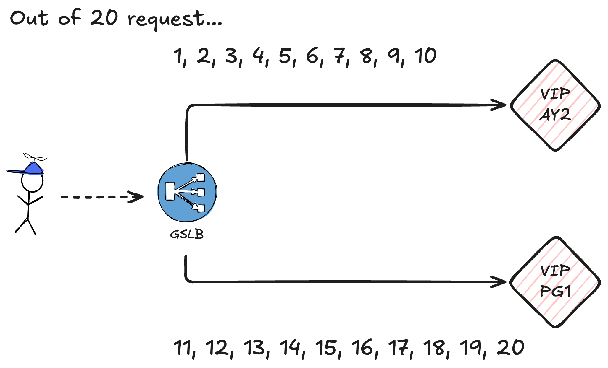
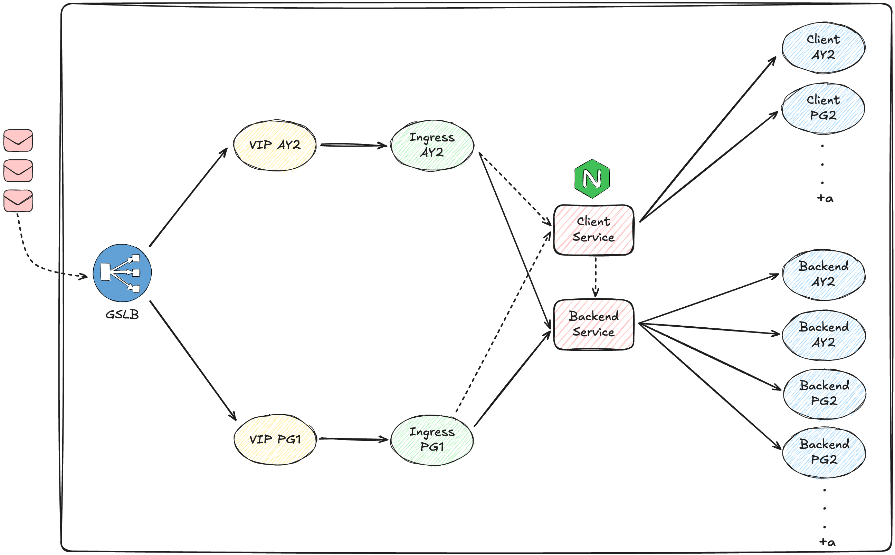
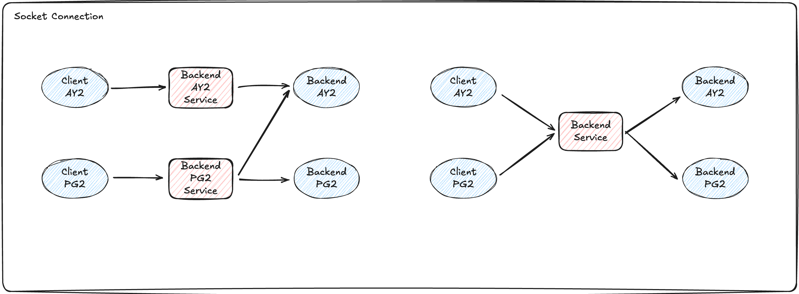

<!--
title: Multi IDC Region 활용을 위한 k8s 설정
tags: k8s,Architecture,node.js
allow_publishing: false
-->

## Outline
최근 담당하는 채팅 서비스는 [**Multi IDC 환경을 도입**](#)했지만, 특정 상황에서 DNS 캐싱으로 Region에 트래픽이 고정되어 연결 지연 문제가 발생했습니다. 이로 인해 유저가 사용자에게 연결될 때 최대 6~10분의 지연이 발생할 수 있었으며, Multi IDC의 장점을 충분히 살리지 못하는 상황이 발생하였습니다. 이를 개선하기 위해 Kubernetes(K8s) 구성 변경을 진행하였습니다.

## GSLB 분배 정책으로 발생하는 트래픽 쏠림 현상

### 변경 전 k8s 구성

> 각각의 Backend Pods에는 사용자가 접속되어 있음.

위 설명을 요약하자면 **최초 접속은 정상**적으로 이루어지지만 **재접속 시 지연이 발생**하는 경우가 많음, 이는 **GSLB 정책에 따른 DNS 캐싱 영향** 때문인데, 특정 Region에 캐싱된 DNS가 고정되면서, 이후 요청이 다른 Region으로 전달될 경우 연결 지연 발생.

위 이미지와 같이 GSLB는 동일한 비율로 분배하는 **균등 분배**가 아닌, 한 Region에 집중적으로 트래픽을 보낸 후, 일정 구간이 지나면 다른 리전에 분배하는 **차등 분배**를 하고 있다.

#### 특징
- Region별로 Service와 Ingress가 독립적으로 구성됨
- GSLB는 트래픽을 차등 분배 방식으로 전달
   - 예: 일정 구간 동안 한 리전에 집중 후, 다른 리전으로 분배

#### 문제점
- 사용자가 최초 접속 시 특정 리전에 할당되면, 재연결도 해당 리전으로 이루어져야 원활한 연결 가능
- 하지만 트래픽이 다른 리전으로 분산될 경우, Pod 탐색 과정에서 불필요한 지연이 발생

> [!IMPORTANT]
>
> **요청 분배 방식이 서비승에 미치는 영향**
>
> **사용자가 최초 진입 시 AY2에 할당되었다면, 재연결 시에도 AY2로 접속해야만 원활한 연결이 가능하다. 
> 그러나 위와 같은 분배 방식으로 인해 재연결 트래픽이 PG1로 빠지는 경우, 예를 들어 100번의 요청이 발생했다면, 100번의 요청 이후 트래픽이 AY2 전환되는 문제가 발생할 수 있다.**
>
> **이를 계산할 때 Pod의 수까지 고려하면, 한 리전에 머무르는 요청 횟수가 단순히 100이 아니라 100 + α 로 증가할 가능성이 있다. 이는 트래픽 부하와 연결 안정성에 영향을 미칠 수 있으므로, 적절한 분배 전략이 필요하다.**

## 내부 구성도를 변경하여 GSLB 트래픽 분배 방식 제어

### 변경 후 k8s 구성도

> 차등분배로 들어오더라도 적절한 endpoint에 도달 할 수 있도록 Ingress에서 트래픽 2차 제어.

### 구성도 변화에 따른 트래픽 흐름.

nginx를 이용하여, 요청 유형에 따른 트래픽을 적절하게 분배.
API 요청은 -> Server
화면 요청은 -> Client
메지시 수신은 -> Message Queue Server Consume

---

## 개선된 구조
### 주요 변경 사항

1. Region 종속 Service 제거
   - 리전별 Service 대신 중립 Service를 생성
   - Service는 Cluster 내 네트워크 라우팅만 담당하므로, 특정 리전에 묶이지 않음 
2. Ingress 트래픽 2차 제어
   - GSLB가 차등 분배를 하더라도, Ingress(nginx) 단계에서 올바른 Pod로 트래픽을 분배하도록 변경
3. Service 동작 방식 최적화
   - Service 자체는 트래픽을 직접 전달하지 않고, 라우팅 규칙을 정의하는 역할 
   - kube-proxy 또는 Cilium이 해당 규칙에 따라 실제 트래픽을 적절한 Pod로 전달 
   - Pod가 다른 리전에 있더라도, Node 간 직접 통신을 통해 트래픽 전달 가능

[//]: # (&#40;이미지 첨부 예정..&#41;)
장애 발생 시 처리 흐름
Backend Pod 장애 → Ingress가 트래픽을 차단
Client Pod 장애 → Ingress에서 연결 차단
Region Pod 장애 → GSLB에서 해당 리전 트래픽 차단

### 네트워크 구성 요소
> Cilium VXLAN 터널링
> tunnel: vxlan 설정을 통해 모든 노드 간 네트워크 터널 자동 구성
> 서로 다른 리전의 Node 간에도 안정적으로 트래픽 전달 가능
