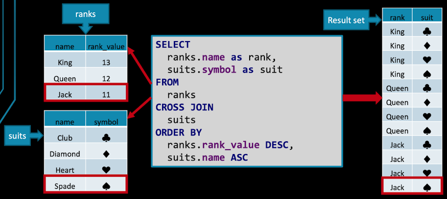

<!--
title: SQL JOIN 유혈
tags: SQL,JOIN,mysql,oracle,postgresql
allow_publishing: false
-->

## outline

- **JOIN** 유형별 설명
- SQL에서 **JOIN**은 여러 테이블의 데이터를 연결하여 하나의 결과 셋을 생성하는 기능.
- 대표적인 JOIN 유형:
  - `CROSS JOIN`
  - `INNER JOIN`
  - `OUTER JOIN` (LEFT, RIGHT, FULL)
  - `USING`, `NATURAL JOIN`
  - `LATERAL JOIN`

## JOIN 유형별 설명

### 1. **CROSS JOIN**

- **카테시안 곱(Cartesian Product)**을 생성. 모든 조합이 결과로 나옴.
- 예: 카드 게임의 rank와 suit를 조합하여 전체 카드 덱 구성
- `ranks CROSS JOIN suits` 또는 `FROM ranks, suits`

```sql
SELECT 
  ranks.name AS rank,
  suits.symbol AS suit
FROM 
  ranks, suits
ORDER BY 
  ranks.rank_value DESC,
  suits.name ASC;
```



> **카테시안 곱**
>
> 카테시안 곱(Cartesian Product)은 두 집합 AAA와 BBB가 있을 때, AAA의 모든 원소와 BBB의 모든 원소를 짝지어 만든 순서쌍들의 집합을 말한다.
>
> 예) 두 집합(혹은 테이블)의 모든 원소(행)를 순서쌍(결합)으로 만드는 연산
>
> A와 B가 집합이라 할 때,
> $$
> A \times B = \{\, (a, b) \mid a \in A,\; b \in B \}
> $$
> 두 집합이 아래와 같을 떄
>$$
> A = \{1, 2\}, \quad B = \{\text{"a"}, \text{"b"}\}
> $$
> 모든 원소를 순서쌍으로 만듦
> $$
> A \times B
>= \{\, (1, \text{"a"}),\;(1, \text{"b"}),\;(2, \text{"a"}),\;(2, \text{"b"}) \}
> $$

#### ⚠️ 주의 사항 및 성능 고려

**복잡도**: 두 집합(또는 테이블) 크기를 각각 n, m이라 하면, 결과는 n 𝑥 m 개의 행이 생성됩니다.

#### ⚙️ 실행 계획(Execution Plan) 이해하기

대부분의 RDBMS 옵티마이저는 CROSS JOIN 연산을 **Nested Loops Join** 또는 **Hash Join** 방식으로 처리합니다.

- **Nested Loops:**
  - 작은 테이블을 외부 루프(loop)로, 큰 테이블을 내부 루프로 돌리면
  - 총 반복 횟수 = 작은 쪽 행 수 × 큰 쪽 행 수
- **Hash Join:**
  - 작은 쪽 전체를 메모리에 해시 테이블로 만든 뒤
  - 큰 쪽 행을 하나씩 해시 테이블에서 매칭하며 조회
  - 메모리에 테이블이 올라갈 수 있어야 효과적

> **주의**: 해시 테이블 생성 자체도 메모리·CPU를 많이 쓰므로, 양쪽 테이블 규모가 크면 디스크 스펠(Spill) 발생으로 성능이 급락할 수 있습니다.

**인덱스는?**

- CROSS JOIN은 **매칭 조건이 없기** 때문에 인덱스 스캔이 아닌 테이블 풀 스캔이나 전체 빌드 과정을 거칩니다.
- 따라서 아무리 인덱스를 잘 구성해도, 카테시안 곱 자체의 I/O 비용을 줄이진 못합니다.

### 2. **INNER JOIN**

- ON 조건이 일치하는 행만 결과로 반환.
- SQL:92 스타일 (`JOIN ... ON`)과 전통적 theta-style (`WHERE`) 방식 모두 가능.
